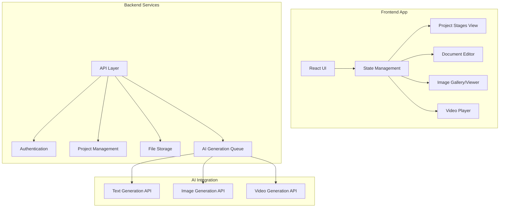

# text-to-film

A tool for transforming text into film using AI agents that emulate film industry roles. Each agent is designed to either act like or assist people in specific film industry roles, providing insights and guidance for subsequent agents/models in the pipeline.

## 🎯 Current Scope

This tool is currently in early development, focusing on:
- Building the basic infrastructure for AI agent interactions
- Establishing the core text-to-film transformation pipeline
- Creating a simple interface for testing and validation

## 🚀 Getting Started

### Prerequisites

- Node.js (v18 or higher)
- npm or yarn
- Python 3.8+
- Git

### Installation

1. Clone the repository
```bash
git clone https://github.com/ssalcedo00/text-to-film.git
cd text-to-film
```

2. Install frontend dependencies
```bash
cd frontend
npm install
```

3. Install backend dependencies
```bash
cd ../backend
pip install -r requirements.txt
```

4. Start the development servers
```bash
# Terminal 1 - Frontend
cd frontend
npm start

# Terminal 2 - Backend
cd backend
uvicorn app.main:app --reload
```

## 🏗️ Architecture

The project uses a modern tech stack:

- **Frontend**: React, TailwindCSS, Material-UI
- **Backend**: FastAPI, Python
- **AI Integration**: Custom AI agents for different film roles
- **Database**: [Coming soon]

### System Overview


## 🤝 Contributing

We welcome contributions! Here's how you can help:

1. Fork the repository
2. Create your feature branch (`git checkout -b feature/YourFeature`)
3. Commit your changes (`git commit -m 'Add some feature'`)
4. Push to the branch (`git push origin feature/YourFeature`)
5. Open a Pull Request

## 📝 License

This project is licensed under the MIT License - see the [LICENSE](LICENSE) file for details.

## 🙏 Acknowledgments

- The open-source community for their invaluable tools and libraries
- Film industry professionals who provide insights and feedback

## 📞 Contact

Salvador Salcedo - [@ssalcedo00](https://github.com/ssalcedo00)

Project Link: [https://github.com/ssalcedo00/text-to-film](https://github.com/ssalcedo00/text-to-film)

---

<p align="center">Made with ❤️ for the filmmaking community</p>