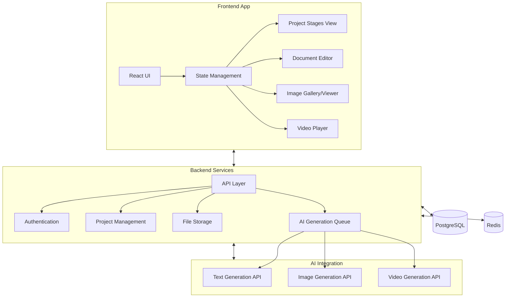
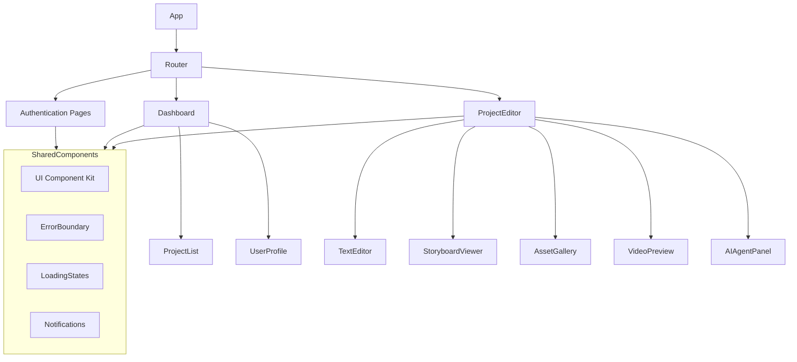
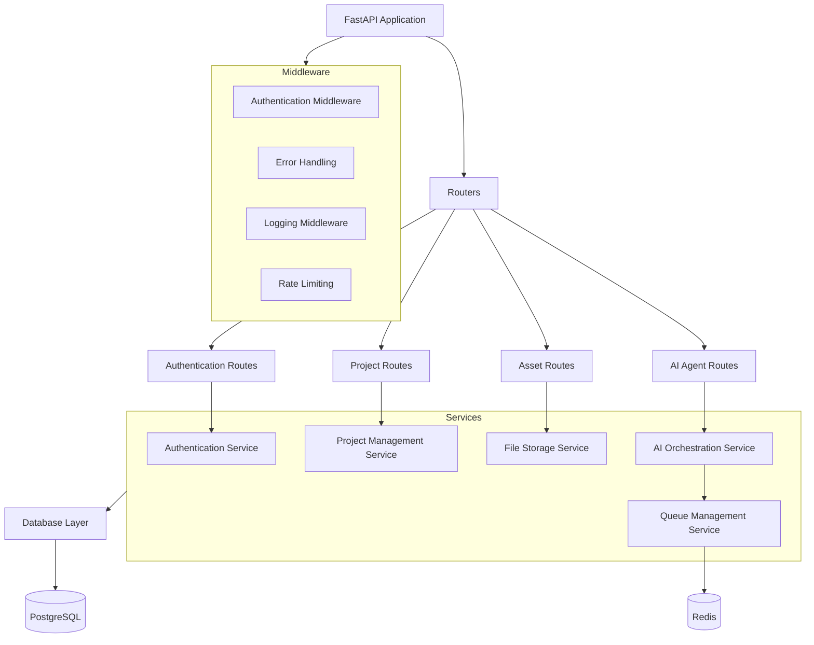
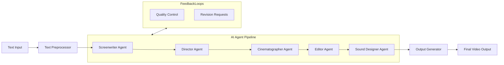
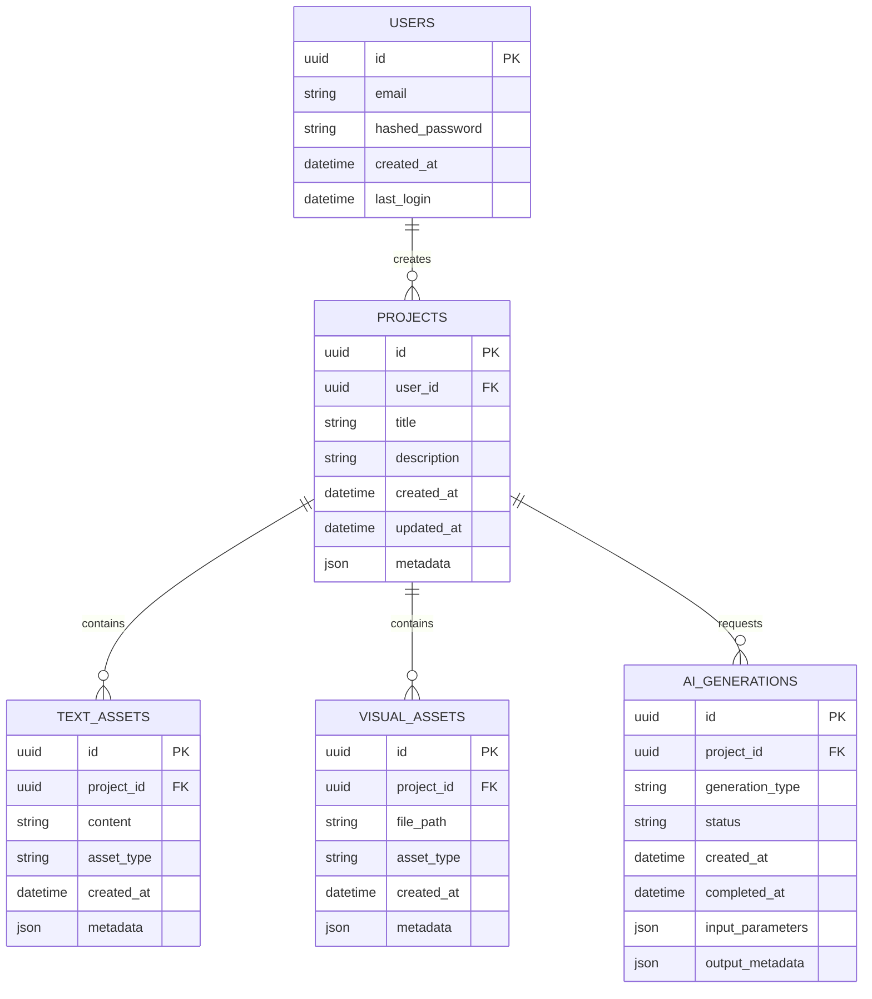
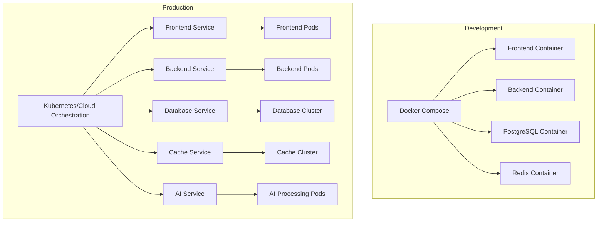
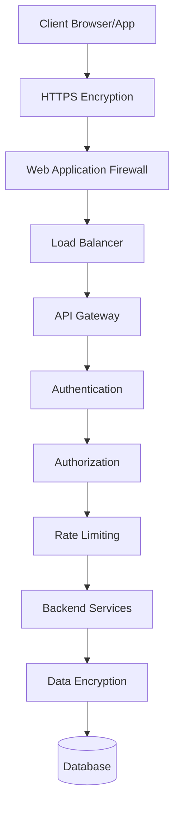
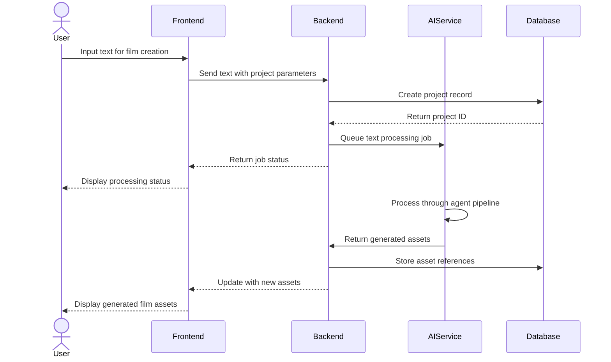

# Text-to-Film Architecture

## Table of Contents
- [1. System Overview](#1-system-overview)
- [2. Component Architecture](#2-component-architecture)
  - [2.1 Frontend Architecture](#21-frontend-architecture)
  - [2.2 Backend Architecture](#22-backend-architecture)
  - [2.3 AI Agent Architecture](#23-ai-agent-architecture)
- [3. Data Architecture](#3-data-architecture)
  - [3.1 Database Schema](#31-database-schema)
- [4. Deployment Architecture](#4-deployment-architecture)
- [5. Security Architecture](#5-security-architecture)
- [6. Communication Flow](#6-communication-flow)
- [7. Technology Stack](#7-technology-stack)
  - [7.1 Frontend](#71-frontend)
  - [7.2 Backend](#72-backend)
  - [7.3 Database & Storage](#73-database--storage)
  - [7.4 DevOps](#74-devops)
  - [7.5 AI Integration](#75-ai-integration)

## 1. System Overview

Text-to-Film is a web application with a modern client-server architecture, designed to transform text into film using AI agents that emulate film industry roles.

## 2. Component Architecture

### 2.1 Frontend Architecture

The frontend is built using React with a component-based architecture:

#### Key Frontend Components:
- **React**: Core UI library (v19.0.0)
- **Material-UI**: Component library for consistent design (v6.3.0)
- **TailwindCSS**: Utility-first CSS framework for styling
- **Tanstack Router**: For client-side routing
- **Axios**: For API communication
- **Supabase Client**: For authentication and storage

### 2.2 Backend Architecture

The backend is built using FastAPI with a service-oriented architecture:

#### Key Backend Components:
- **FastAPI**: Modern, high-performance web framework
- **SQLAlchemy**: ORM for database interactions
- **Pydantic**: Data validation and settings management
- **Python-Jose**: JWT token handling for authentication
- **Redis**: For queue management and caching
- **PostgreSQL**: Primary database

### 2.3 AI Agent Architecture

The AI agent system follows a pipeline architecture:

## 3. Data Architecture

### 3.1 Database Schema

## 4. Deployment Architecture

The application is containerized using Docker and can be deployed in various environments:

## 5. Security Architecture

## 6. Communication Flow

## 7. Technology Stack

### 7.1 Frontend
- **Framework**: React 19.0.0
- **UI Libraries**: Material-UI 6.3.0, TailwindCSS
- **State Management**: React Context/Hooks
- **Routing**: Tanstack Router
- **API Communication**: Axios
- **Build Tools**: React Scripts, PostCSS

### 7.2 Backend
- **Framework**: FastAPI
- **ORM**: SQLAlchemy
- **Authentication**: JWT (python-jose)
- **Data Validation**: Pydantic
- **File Handling**: Python-multipart
- **Image Processing**: Pillow

### 7.3 Database & Storage
- **Primary Database**: PostgreSQL 16
- **Caching/Queue**: Redis
- **File Storage**: Local filesystem (development), Cloud storage (production)

### 7.4 DevOps
- **Containerization**: Docker
- **Orchestration**: Docker Compose (development)
- **CI/CD**: [To be determined]

### 7.5 AI Integration
- **Text Generation**: [To be determined]
- **Image Generation**: [To be determined]
- **Video Generation**: [To be determined] 